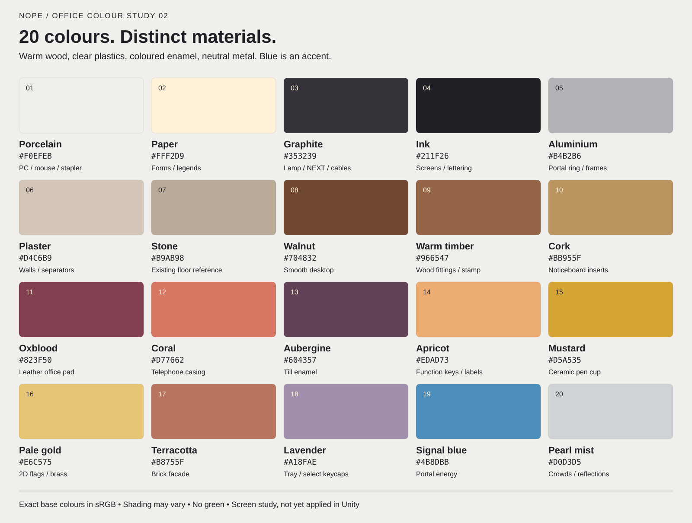

# Office palette: 20 colours

2026-09-26. This proposal responds to the repeated-blue feedback. It supersedes the earlier blue-heavy screen study. The colours and textures are now applied in Unity, with the PC explicitly excluded. See [applied report](../Applied/README.md) and [actual GameView](../Applied/runtime.png).

## Material assignments

These are exact sRGB **base colours**, not an indexed limit on rendered pixels. Lighting, cel shadows and reflections can create related values. A palette is a controlled vocabulary; every object does not need all twenty colours.

| # | Colour | Hex | Role |
|---|---|---|---|
| 01 | Porcelain | `#F0EFEB` | Mouse and stapler; PC excluded from implementation |
| 02 | Paper | `#FFF2D9` | Forms and key legends |
| 03 | Graphite | `#353239` | Lamp shade, NEXT housing, cables |
| 04 | Ink | `#211F26` | Screens, lettering and deep seams |
| 05 | Aluminium | `#B4B2B6` | Portal ring and window frames |
| 06 | Plaster | `#D4C6B9` | Booth wall and separator panels |
| 07 | Stone | `#B9AB98` | Existing floor colour reference |
| 08 | Walnut | `#704832` | Smooth desktop |
| 09 | Warm timber | `#966547` | Desk edge, stamp and form sorter |
| 10 | Cork | `#BB955F` | Noticeboard inserts |
| 11 | Oxblood | `#823F50` | Plain leather office pad |
| 12 | Coral | `#D77662` | Telephone casing |
| 13 | Aubergine | `#604357` | Till enamel |
| 14 | Apricot | `#EDAD73` | Selected function keys and tiny labels |
| 15 | Mustard | `#D5A535` | Ceramic pen cup |
| 16 | Pale gold | `#E6C575` | Flat flag sprites and small brass fittings |
| 17 | Terracotta | `#B8755F` | One brick building |
| 18 | Lavender | `#A18FAE` | Document tray and a few keycaps |
| 19 | Signal blue | `#4B8DBB` | Portal energy and tiny status indicators |
| 20 | Pearl mist | `#D0D3D5` | Distant crowd and sparse glass reflections |

## Screen application

The user clarified the setting: an ill-maintained government building offers compulsory travel into the past as an opportunity to pay debt. It should look pleasant on the surface but feel disturbing. Screens 03 and 04 develop this direction using selective neglect and optimistic debt-relief messaging. See [current mood and layout](MOOD_AND_LAYOUT.md) for confirmed setting, proposed storytelling and the five requested desk-layout changes. These remain generated previews. The later Unity pass applied colours/textures and crowd clearance only; the five desk-layout notes and worn surfaces were applied in the subsequent [correction](../Applied/LayoutWear/README.md). Storytelling additions remain concepts.

Latest preview:

Earlier colour-only study:

Generated with the built-in image tool using the original Unity screenshot for layout and the previous study for quiet wood/lighting. The exact prompt is in [screen-02.prompt.md](screen-02.prompt.md). The paint-over illustrates colour relationships; the swatches/JSON define exact values. It is not a runtime capture or a promise of pixel-perfect geometry preservation. The earlier lamp drift has been corrected to a banker's lamp in the preview. Preserve the actual in-game geometry, floor, placements and glass transmission during implementation.

No blanket hue replacement: the desk pad is burgundy leather, till aubergine enamel, phone coral plastic, tray lavender plastic, cup mustard ceramic, and lamp charcoal metal. Mouse/stapler use neutral porcelain. The user later explicitly excluded the PC, so its current materials and appearance are preserved. Portal energy is the only strong blue area; its casing stays coherent aluminium. Independently coloured buildings remain visible through glass.

Keep the tabletop quiet: broad smooth walnut boards, very faint grain and soft value changes. Use normal material logic for related repeats (paper, metal, wood), and distinct coloured finishes for unrelated large props. Preserve the original floor; Stone is only a reference to its existing colour. Character generation resumed after the applied office pass was verified.

This folder preserves the palette guide and generated concepts. Applied Unity changes and validation are recorded in ../Applied/. The earlier four flag SpriteRenderers are retained.
